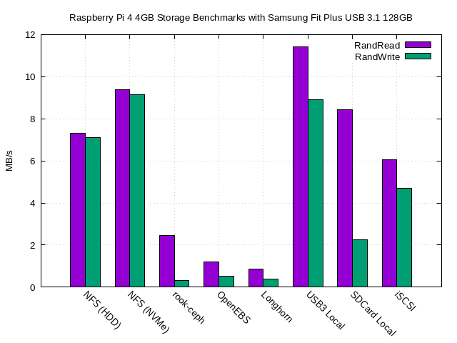

This is mainly covering [block storage](https://en.wikipedia.org/wiki/Block-level_storage), since before looking into this I couldn't really find any universally recognized good/viable option for Raspberry Pis. If you only need file storage, just use NFS. I was going to look into managing object storage also, but decided that deserves its own blog post.

tl;dr - You can pick two:

* Failover
* Dynamic Provisioning
* Performance

# Methods

I tested these solutions on top of $15 128GB USB 3.1 Samsung drives. My interest is finding the greatest bang for my buck in terms of overall usability. I am far more interested in seeing what performs "Good" with a $45 upfront cost as opposed to seeing what performs "Great" and paying for solid state/NVMe drives.

Variables worth mentioning:
* My nodes run Ubuntu 20 LTS (Required for rook-ceph since Raspbian doesn't include the `rdb` module)
* I tested using iozone 4k RandRead/RandWrite - This sets the stage for how most other benchmarks (dd/hdparm) would go since it is pretty rigorous.
* My network is fully gigabit.
* The drives do not leverage UASP/TRIM. I do not want to purchase 3 SSDs.


```yaml
apiVersion: batch/v1
kind: Job
metadata:
  name: filesystem-benchmark
spec:
  backoffLimit: 1
  template:
    spec:
      restartPolicy: Never
      containers:
      - name: filesystem-benchmark
        image: quay.io/igou/benchmarking-container:latest
        command: ["/usr/bin/iozone"]
        args: ["-a", "-f", "/mnt/volume/iozone-test","-e","-I","-r","4k","-i","0","-i","1","-i","2"]
        volumeMounts:
        - name: test-volume
          mountPath: /mnt/volume
      volumes:
      - name: test-volume
        persistentVolumeClaim:
          claimName: test-pvc
          readOnly: false
```

`igou/benchmarking-container` is just an Alpine image with iozone and some other tools I never got around to using installed.

# Baseline: nfs

I think NFS is a fair comparison. NFS is widely used and accepted and in my consulting career I often have to advise block storage over NFS for performance reasons ("But NFS is easy"). That only applies to enterprise applications, though. Great NFS performance is easy to achieve on Pis because of how well documented performance tuning is.

Export options: `rw,no_root_squash,insecure,async,no_subtree_check`



```
	Command line used: /usr/bin/iozone -a -f /mnt/volume/iozone-test -e -I -r 4k -i 0 -i 1 -i 2
	Output is in kBytes/sec
	Time Resolution = 0.000001 seconds.
	Processor cache size set to 1024 kBytes.
	Processor cache line size set to 32 bytes.
	File stride size set to 17 * record size.
                                                              random    random     bkwd    record    stride                                    
              kB  reclen    write  rewrite    read    reread    read     write     read   rewrite      read   fwrite frewrite    fread  freread
              64       4     8806     8269     8148     8449     7042     7443                                                                
             128       4     7193     7770     7289     7169     7575     7554                                                                
             256       4     9052     9080     8195     7359     8213     2761                                                                
             512       4     7635     8815     8716    10237     7654     8671                                                                
            1024       4     6417     7157     6474     7149     7152     7506                                                                
            2048       4     7348     6922     6621     7112     6725     7083                                                                
            4096       4     7394     7456     7158     7387     6943     7636                                                                
            8192       4     6790     6848     7069     6456     7243     7956                                                                
           16384       4     7738     7408     6996     7285     7538     7305                                                                
           32768       4     7052     7370     6935     7080     6787     7345                                                                
           65536       4     7151     7297     7395     7010     7268     5970                                                                
          131072       4     6951     7094     7355     7280     7816     7657                                                                
          262144       4     6943     7419     7254     7586     7125     7289                                                                
          524288       4     7179     7355     7335     7317     7259     7148                                                                
```


```
Command line used: /usr/bin/iozone -a -f /mnt/volume/iozone-test -e -I -r 4k -i 0 -i 1 -i 2
Output is in kBytes/sec
Time Resolution = 0.000001 seconds.
Processor cache size set to 1024 kBytes.
Processor cache line size set to 32 bytes.
File stride size set to 17 * record size.
                                                            random    random     bkwd    record    stride                                    
            kB  reclen    write  rewrite    read    reread    read     write     read   rewrite      read   fwrite frewrite    fread  freread
            64       4     9717     9763    10004     9763     9683    10418                                                                
           128       4     7749    10714    12041    11275    10340     5615                                                                
           256       4    10242     9766    10018    10502     9738     9972                                                                
           512       4     9935     9938     9456     9282    10041     9734                                                                
          1024       4    10406    10263     9670     8863     8932    10257                                                                
          2048       4     9816     9367     8954     8671     9607     9103                                                                
          4096       4     7573     9106     8131     9632     9259     9666                                                                
          8192       4     9385     9392     8916     9397     9264     9347                                                                
         16384       4     9208     9559     8966     9272     9315     8868                                                                
         32768       4     8866     9465     8977     8535     8944     9393                                                                
         65536       4     8939     9275     9305     8985     9184     8269                                                                
        131072       4     7387     7710     8669     9033     9129     9211                                                                
        262144       4     9155     9420     8885     9057     9103     9304                                                                
        524288       4     9052     9232     9275     9159     8963     8823                                                                
```



These are pretty darn respectable. Couple that with the nfs-storage-provisioner and you are in business. Bonus points because external storage makes cluster rebuilds a breeze. This had me asking "Do I really need block storage?"

# Rook-ceph, OpenEBS, Longhorn

AKA "CNCF Kubernetes Native solutions"

All of these are lumped together because they all have the same tl;dr: They work on Pis, but at the cost of performance.

All benchmarks were done with any obvious performance enhancers checked, but I didn't invest huge amount of hours into tweaking settings.



```
	Command line used: /usr/bin/iozone -a -f /mnt/volume/iozone-test -e -I -r 4k -i 0 -i 1 -i 2
	Output is in kBytes/sec
	Time Resolution = 0.000001 seconds.
	Processor cache size set to 1024 kBytes.
	Processor cache line size set to 32 bytes.
	File stride size set to 17 * record size.
                                                              random    random     bkwd    record    stride                                    
              kB  reclen    write  rewrite    read    reread    read     write     read   rewrite      read   fwrite frewrite    fread  freread
              64       4      330      331     1416     1092     1660      341                                                                
             128       4      327      370     1571     2635     2507      345                                                                
             256       4      340      327     1558     2016     2455      346                                                                
             512       4      253      354     2170     2767     2738      176                                                                
            1024       4      375      391     2284     3227     3326      357                                                                
            2048       4      359      343     2161     2803     2927      295                                                                
            4096       4      337      335     1915     3561     2072      350                                                                
            8192       4      315      335     1934     3401     2996      323                                                                
           16384       4      337      332     1924     2223     2790      320                                                                
           32768       4      332      343     1445     2546     2256      328                                                                
           65536       4      336      338     1857     2973     2049      321                                                                
          131072       4      328      326     1965     2964     2406      322                                                                
          262144       4      310      332     1924     2653     2312      318                                                                
          524288       4      333      329     1879     2134     1963      312                                                                
```


```
	Command line used: /usr/bin/iozone -a -f /mnt/volume/iozone-test -e -I -r 4k -i 0 -i 1 -i 2
	Output is in kBytes/sec
	Time Resolution = 0.000001 seconds.
	Processor cache size set to 1024 kBytes.
	Processor cache line size set to 32 bytes.
	File stride size set to 17 * record size.
                                                              random    random     bkwd    record    stride                                    
              kB  reclen    write  rewrite    read    reread    read     write     read   rewrite      read   fwrite frewrite    fread  freread
              64       4      442      567      748     1025     1274      616                                                                
             128       4      608      636      975     1018     1159      535                                                                
             256       4      633      668      983     1118     1278      585                                                                
             512       4      667      677      998     1072     1078      623                                                                
            1024       4      699      722     1052     1272     1298      838                                                                
            2048       4      443      627     1242     1274     1239      839                                                                
            4096       4      571      476     1450     1219     1277      845                                                                
            8192       4      764      919     1372     1279     1128      560                                                                
           16384       4      643      619     1242     1238     1146      382                                                                
           32768       4      459      700     1253     1307     1180      634                                                                
           65536       4      577      488     1179     1258     1192      376                                                                
          131072       4      393      451     1231     1213     1173      297                                                                
          262144       4      399      465     1208     1179     1143      279                                                                
          524288       4      412      458     1194     1204     1105      176                                                                
```


```
Command line used: /usr/bin/iozone -a -f /mnt/volume/iozone-test -e -I -r 4k -i 0 -i 1 -i 2
Output is in kBytes/sec
Time Resolution = 0.000001 seconds.
Processor cache size set to 1024 kBytes.
Processor cache line size set to 32 bytes.
File stride size set to 17 * record size.
                                                            random    random     bkwd    record    stride                                    
            kB  reclen    write  rewrite    read    reread    read     write     read   rewrite      read   fwrite frewrite    fread  freread
            64       4      509      540      353     1098     1194      593                                                                
           128       4      566      644     1109     1264     1210      444                                                                
           256       4      689      832      918      841      561      353                                                                
           512       4      566      516      795     1060     1059      236                                                                
          1024       4      255      190      872      702      668      171                                                                
          2048       4      215      126      474      584      687      133                                                                
          4096       4      473      616      741      737      724      520                                                                
          8192       4      585      426      686      670      699      486                         
[I somehow lost the rest of this data but it didn't change much..]

```



It's also important to note that these solutions have a high "cost" of compute. Especially for Rook, you will likely need to have your own dedicated storage nodes. Also storage solutions that are hosted on your cluster makes rebuilding very complicated. I want to be able to microwave my SD cards and be back up relatively quickly. Rebuilding the cluster and keeping your data basically involves going through the DR process for most of these.

## rook-ceph

I was anxious to try this because the maintainers started pushing Arm64 images only a couple months ago. Also Red Hat's Openshift Container Storage is based off of this, and I like to gravitate towards adopting stuff that makes me better at my job. I really wanted this to be good. But when you look at [Ceph's recommended specs](https://docs.ceph.com/en/latest/start/hardware-recommendations/) you wonder how this even ran in the first place. I don't see this ever having supported optimizations for the Pi.

Here is a [video](https://youtu.be/wZiyzoyX2Bc) of me running through the installation.

## OpenEBS Jiva

Performed roughly the same as Rook but used less resources upfront. I don't fully understand its architecture and didn't spend much time diving into optimizations. Haven't seen much in the wild on this.

## Rancher Longhorn

Arm support isn't officially merged yet, I deployed this using a testing branch. Tiny resource footprint. I was able to make the performance of Longhorn pretty decent (~2MB write, lost data though.) by doing stupid stuff like turning off replication and setting it to use lots of resources, but that removed the purpose of even using it.

I dislike the documentation and found it too "User interface demo magic" focused. It was very difficult (impossible?) to find CRD documentation or figure out how to do anything as code.

That said, it has some really cool features, such as integrated s3 backups. I will revisit this tool, because out of all of the distributed options, Rancher are the maintainers I can see giving the Pi some support.

## Distributed storage conclusion:

These aren't worth using for self hosting. But it was a lot of fun getting these working on Pis and they can be great for gaining real world experience.

There is another, GlusterFS based operator [Kudalu](https://kadalu.io/) I did not test, but a colleague of mine average 2MB/s write on his cluster. I got tired of tearing these solutions down/up, I will come back and try Kudalu later.

# Local Volume Provisioner

Rancher bundles a "Local Volume Provisioner" with k3s which does a great job at getting you off the ground. PVs that are dynamically created using this storageclass exist as directories in `/var/lib/rancher/k3s/storage`. I give this directory its own partition so PVs don't effect the usage of the host filesystem. I tested the sd card while I was at it to show the boost from USB.



```
	Command line used: /usr/bin/iozone -a -f /mnt/volume/iozone-test -e -I -r 4k -i 0 -i 1 -i 2
	Output is in kBytes/sec
	Time Resolution = 0.000001 seconds.
	Processor cache size set to 1024 kBytes.
	Processor cache line size set to 32 bytes.
	File stride size set to 17 * record size.
                                                              random    random     bkwd    record    stride                                    
              kB  reclen    write  rewrite    read    reread    read     write     read   rewrite      read   fwrite frewrite    fread  freread
              64       4     8481     8700     1947    13716    11122     4373                                                                
             128       4    12605     8875    13748     7222    11881    10912                                                                
             256       4    11225    15343    10494    14007    14628     8569                                                                
             512       4    12762    17580    13077     6415    15188    13915                                                                
            1024       4    13048    15748    14057    14917    14281    14469                                                                
            2048       4    13680    15723    15039    14908    10106    12401                                                                
            4096       4    13947    18034    16750    12447    15833    11577                                                                
            8192       4    14438     3305     6027     4725    11920     6042                                                                
           16384       4    14149    16730    12892    12428    10974    10986                                                                
           32768       4    10543    16193    12032    11000    10177     1545                                                                
           65536       4     8565    14911     9873    13289     9841     4992                                                                
          131072       4     6471    13040     4329    10830     7108    10761                                                                
          262144       4     8870     8251    10064    10159     8792     7819                                                                
          524288       4     9315     9383     9465    10724     8175     6284                                                       
```       


```
	Command line used: /usr/bin/iozone -a -f /iozone-test -e -I -r 4k -i 0 -i 1 -i 2
	Output is in kBytes/sec
	Time Resolution = 0.000001 seconds.
	Processor cache size set to 1024 kBytes.
	Processor cache line size set to 32 bytes.
	File stride size set to 17 * record size.
                                                              random    random     bkwd    record    stride                                    
              kB  reclen    write  rewrite    read    reread    read     write     read   rewrite      read   fwrite frewrite    fread  freread
              64       4     2441     2637     7594     8950     9371     1769                                                                
             128       4     2790     1817     3810     8510     8782     1814                                                                
             256       4     2682     3861     7499     8255     8093     2832                                                                
             512       4     3590     4238     8606     8942     8609     3734                                                                
            1024       4     3763     4771     9143     9610     9087     4268                                                                
            2048       4     3971     4386     8811     8597     8294     4113                                                                
            4096       4     3749     3836     6759     7561     8541     3583                                                                
            8192       4     3921     4510    11664    11192     9436     3796                                                                
           16384       4     3929     4373     7704    10512    10131     3458                                                                
           32768       4     3181     3113     9308     8652     7076      768                                                                
           65536       4     3942     4072     8362     7656     7719     1830                                                                
          131072       4     2962     2917     8442     7601     7451     1195                                                                
          262144       4     2695     2789     9177     8802     8487     1378                                                                
          524288       4     2489     2569     9118     8434     6930     1188                                                       
```       



Conclusion: Pretty good. This is some of the best performance we'll see before getting SSDs involved. This is simple to set up but does cause *some* issues:
* PVs are bound to nodes. This gives no failover (If the node dies, the workload cannot migrate since it lost its storage)
* Being node bound can cause some weird scheduling problems. For example, I did a rebuild once and everything that needed storage *happened* to schedule on worker-1, placing it at 90% capacity while the other nodes were at 10%, but I could not move the work over due to the volumes.
* You can technically migrate storage manually by plugging in a drive to another node, copying it over, and editing the pv definition, but it's very annoying.
* Full rebuilds require some OS maintenance (Adding the drive to `/etc/fstab`), but after that you should be good to recreate your pv/pvc manifests.

Take a second to take in the ratio of performance lost when you use these drives for the distributed solutions tested previously. It makes it all the more likely that the bottleneck for those solutions wasn't disk I/O, and was more likely to be CPU/Memory limitations of the Pi. I don't think throwing money at this would make the enterprise tools viable.

# Manually provisioned iSCSI

It was at this point I realized "needing" block storage is uncommon and it shouldn't be too painful manually provisioning whatever I need. No storage tools running on my cluster means it is more lean and less prone to catastrophic failure also.

Shared from another Raspberry Pi 4 4GB using the same model flash drive used from the other tests.

```
Command line used: iozone -a -f /var/lib/rancher/k3s/storage/iozone-test -e -I -r 4k -i 0 -i 1 -i 2
Output is in kBytes/sec
Time Resolution = 0.000001 seconds.
Processor cache size set to 1024 kBytes.
Processor cache line size set to 32 bytes.
File stride size set to 17 * record size.
                                                            random    random     bkwd    record    stride                                    
            kB  reclen    write  rewrite    read    reread    read     write     read   rewrite      read   fwrite frewrite    fread  freread
            64       4     3355     3661     4358     5060     5972     4174                                                          
           128       4     4439     5042     5597     6278     5608     3268                                                          
           256       4     4772     5094     7206     6705     6455     5055                                                          
           512       4     1560     4831     6087     6209     6140     5434                                                          
          1024       4     4935     4889     5969     6063     5220     4858                                                          
          2048       4     4830     5619     5378     6046     6601     5372                                                          
          4096       4     5212     2509     6717     6693     5976     5131                                                          
          8192       4     5208     5550     6182     6340     6375     5407                                                          
         16384       4     5091     5451     6241     6194     6132     3012                                                          
         32768       4     5551     5560     6194     6098     6148     4668                                                          
         65536       4     2971     6063     6069     6196     5827     5918                                                          
        131072       4     5380     4959     6257     6225     6200     4020                                                          
        262144       4     5369     5699     6240     6234     6124     4214                                                          
        524288       4     4749     5955     6261     6165     6169     5098                                                          
```

Conclusion: Good speed that easily migrates between nodes. But if I want a pv, I have to ssh into a host, create the lv, and update `/etc/tgt/conf.d/` There are "iscsi provisioners" available to allow dynamic provisioning, but they are not mature. Well rounded Ansible roles would be a far better option.

# Final Conclusion

I guess I should be thankful that I even have options when you compare this to how things were two years ago. The fancy CNCF solutions are cool but the Pi can't really handle them. (yet?)



I plan on using [nfs-subdir-external-provisioner](https://github.com/kubernetes-sigs/nfs-subdir-external-provisioner) for dynamic NFS, and manual iSCSI for block. Recovery for external storage is just so easy - recreate the volume objects and get on with your life.
